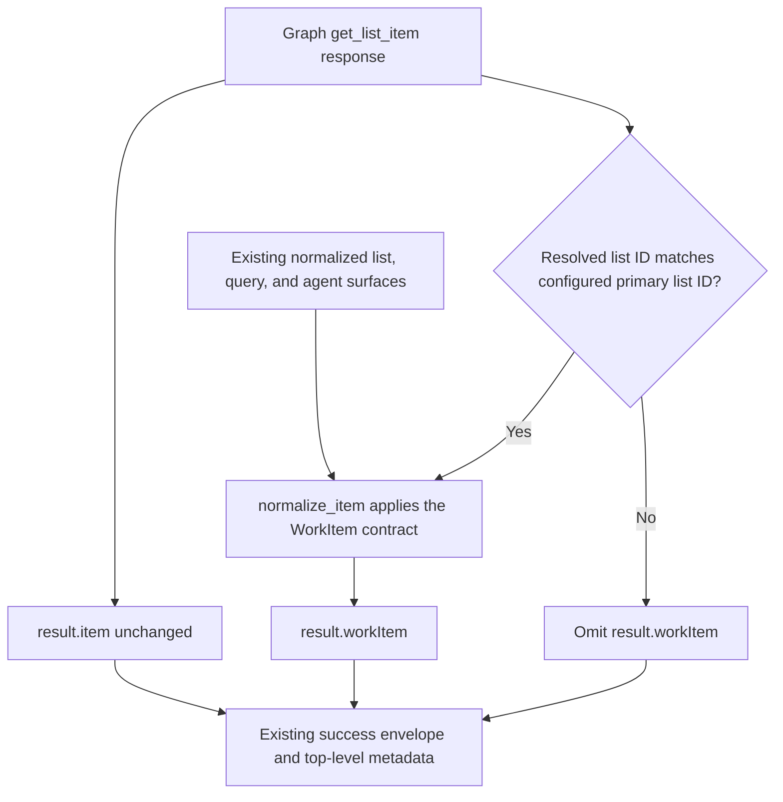

# Normalized WorkBoard Item Capture - Plan

## Goal Capsule

- **Objective:** Define the product contract for stable, item-level capture from `workboard items get <ID>` so automation can consume canonical WorkBoard meaning without repeatedly parsing SharePoint-specific field shapes.
- **Product authority:** This plan owns the requirements and acceptance boundary for normalized capture of a single WorkBoard item through the authoritative WorkItem contract. Additive WorkItem fields will propagate to existing surfaces that already serialize WorkItem, but changing list, query, or intent behavior remains outside active scope, as do new acceptance or closure state and SharePoint writes.
- **Open blockers:** None. Q1 was settled on 2026-08-21 and reaffirmed with the complete contract decision pass on 2026-08-22; Q2-Q7 were session-settled on 2026-08-22.

---

## Product Contract

### Summary

Provide a stable normalized representation of one WorkBoard item while preserving raw source fidelity, source metadata, and existing contract meanings.
Use WorkItem as the single authoritative normalized item contract and extend it additively for missing capture semantics.
For successful retrievals from the configured primary WorkBoard list, `items get` automatically preserves the unchanged raw Graph item at `result.item` and adds WorkItem at `result.workItem`; successful custom-list retrievals remain raw-only.

### Problem Frame

The single-item command currently returns the Graph item directly under the result envelope and does not invoke the repository's normalization path (`src/workboard_cli/cli.py:313-341`).
The separate WorkItem projection already normalizes several fields, but it uses `relProject`, lower-camel date names, and a mix of raw and extracted long-form values; it does not surface `Scope` or `Requirements` (`src/workboard_cli/normalize.py:142-214`; `docs/agent_json_contract.md:64-142`).
As a result, downstream capture and wiki automation must understand both SharePoint field conventions and repository-specific partial normalization before it can treat a work item as a durable operational record.

This matters because a WorkBoard item is the primary operational record even when it has no linked project.
Parsing raw HTML and lookup blobs independently in every consumer makes linked-project, authority, acceptance-evidence, and closure-date capture less reliable.

### Evidence and Decision Status

| Status | Evidence | Contract consequence |
|---|---|---|
| Confirmed repository fact | The product is a read-only, agent-oriented JSON boundary over SharePoint (`STRATEGY.md:7-35`; `AGENTS.md:19-25`). | The feature must remain read-only, keep SharePoint authoritative, and retain source metadata. |
| Confirmed repository fact | `items get` returns the fetched Graph item without normalizing it (`src/workboard_cli/cli.py:313-341`; `src/workboard_cli/sharepoint.py:43-50`). | The reported raw-only gap is verified on clean `main` at revision `ee1e67e`. |
| Confirmed repository fact | The current WorkItem uses `relProject`, `dueDate`, `dateCommitted`, `dateStart`, and `dateClosed`; it extracts text for selected HTML fields and omits `Scope` and `Requirements` (`src/workboard_cli/normalize.py:180-209`; `docs/agent_json_contract.md:111-142`). | The issue's example spellings and field coverage do not match the current projection exactly. |
| Confirmed repository fact | Repository configuration maps `Scope` and `Requirements`, and discovery recorded them as WorkBoard fields (`config/workboard.defaults.yaml:18-44`; `MEMORY.md:34-40`). | Their semantic inclusion is grounded, but their live value and empty-value shapes were not re-discovered in this brainstorm. |
| Confirmed repository fact | Existing WorkItem evolution is additive-only (`docs/plans/2026-08-19-001-feat-cli-evolution-sharepoint-shape-plan.md:26-45`, especially AE8; `docs/plans/2026-08-19-001-feat-cli-evolution-sharepoint-shape-plan.md:565-575`). | Any change to WorkItem must preserve existing keys, types, and meanings. |
| Confirmed repository fact | The current contract says `workboard agent query` is the only agent-facing interface (`docs/agent_json_contract.md:1-6`; `src/workboard_cli/agent.py:22-44`). | `items get` remains a general automation-friendly CLI command and does not expand `APPROVED_INTENTS`. |
| Issue-requested behavior | GitHub issue #6 asks for stable normalized single-item output, raw-field availability, canonical capture fields, and machine-readable linked-project data. | The outcome is delivered through existing WorkItem conventions rather than new aliases copied from the issue examples. |
| Session-settled decision | Adopt WorkItem as the single authoritative normalized item contract and reject a second curated schema. (session-settled: 2026-08-21; reaffirmed: 2026-08-22) | Extend WorkItem additively, expose it at `result.workItem` beside unchanged raw `result.item` for primary WorkBoard retrievals, and propagate additive fields to existing normalized WorkItem surfaces. |
| Session-settled decision | Primary WorkBoard retrievals keep raw data at `result.item` and add WorkItem at `result.workItem` automatically; custom-list retrievals remain raw-only. (session-settled: 2026-08-22) | No opt-in flag is introduced, and existing envelope metadata and not-found behavior remain unchanged. |
| Session-settled decision | WorkItem names remain lower-camelCase, keep only `relProject`, and add `scopeText` and `requirementsText` without aliases. Operational dates remain `dueDate`, `dateStart`, `dateCommitted`, and `dateClosed`. (session-settled: 2026-08-22) | Issue-example casing, `linkedProject`, `scope`, `requirements`, and alternative date aliases are excluded. |
| Session-settled decision | Documented WorkItem keys are always present with category-specific absence sentinels; exceptional absence and malformed content also emit warnings. (session-settled: 2026-08-22) | Raw `result.item` remains the audit source, and malformed content never becomes authoritative normalized output. |
| Session-settled decision | Keep only `sourceUrl` and `workBriefLinks` for link capture; do not introduce `relatedLinks` or a generic taxonomy. (session-settled: 2026-08-22) | Other long-form links remain follow-up, and invalid work-brief entries are warned and omitted from WorkItem. |
| Session-settled decision | `items get` remains outside the approved agent interface. (session-settled: 2026-08-22) | Official AI-agent access remains validated `agent query` intents; conflicting OpenCode routing is deferred contract drift. |
| Assumption | Primary direct consumers are AI agents and downstream capture/wiki automation; delivery leads and managers benefit indirectly from more reliable records. | No usage telemetry or user interview evidence was provided, so success is stated behaviorally rather than as an adoption metric. |

### Actors

- A1. **Automation consumer:** An AI agent or capture process that needs a stable, machine-readable representation of one WorkBoard item.
- A2. **Operator or reviewer:** A person who needs normalized output to remain traceable to the exact SharePoint source values.
- A3. **SharePoint WorkBoard:** The authoritative source system; it supplies item data but is never mutated by this workflow.

### Desired Outcome and Value

An A1 consumer can capture the operational meaning of one item without custom parsing for every raw HTML, lookup, person, or date field.
An A2 reviewer can trace normalized values back to the raw item and see warnings where normalization is incomplete.
The organization gains a reusable item-level contract that does not assume every item belongs to a project and does not manufacture acceptance or closure state absent from SharePoint.

### Candidate Directions

1. **Rejected — curated item-capture projection.** A purpose-built second normalized schema would isolate single-item capture but duplicate WorkItem semantics, documentation, and tests, creating an avoidable drift surface.
2. **Selected — extend the existing WorkItem contract.** (session-settled: 2026-08-21; reaffirmed: 2026-08-22) Add the missing capture semantics to WorkItem and expose that authoritative representation alongside the unchanged raw Graph item. Reusing `normalize.py`, the documented WorkItem contract, and existing normalization tests reduces semantic and documentation drift; additive fields will also propagate to existing normalized list, query, and intent surfaces.

Q1 is settled in favor of direction 2. A raw-only documentation change is not viable because it would leave every downstream consumer responsible for the parsing problem described by the issue.
Q2-Q7 settle the contract within direction 2: fixed response locations, existing WorkItem naming and date conventions, explicit absence and warning semantics, the existing focused link fields, and no expansion of the approved agent interface.

### Requirements

**Source fidelity and compatibility**

- R1. Every successful `items get` request for the configured primary WorkBoard list must preserve the unchanged raw Graph item at `result.item` and automatically add the authoritative WorkItem at `result.workItem` without an opt-in flag.
- R2. WorkItem must remain the single authoritative normalized item contract, with missing capture semantics added without changing current keys, types, or meanings; additive fields propagate to existing normalized list, query, and intent surfaces without changing their behavior.
- R3. The command must remain read-only against SharePoint, require no SharePoint schema change, and preserve `status`, `source`, `retrievedAt`, and `sessionId`.

**Canonical names and item capture**

- R4. WorkItem properties must use lower-camelCase, with missing HTML-free long-form capture added only as `scopeText` and `requirementsText`; parallel `scope` and `requirements` aliases must not be emitted.
- R5. `relProject` must remain the sole normalized project association with shape `{id: int, text: string} | null`; `linkedProject` and other project aliases must not be emitted.
- R6. Documented WorkItem keys must never be omitted, and genuine absence must use `""` for canonical text, `null` for nullable scalar, object, person, project, date, and `sourceUrl` values, and `[]` for link arrays without a warning.

**Human-readable text and links**

- R7. WorkItem long-form text fields, including `scopeText` and `requirementsText`, must be HTML-free while the unchanged raw Graph item retains the original source content for audit.
- R8. Link capture must use only `sourceUrl: string | null` for the item display URL and `workBriefLinks: Array<{url: string, text: string}>` for decoded absolute HTTP(S) links from `RelWorkBrief` anchors; `relatedLinks` and generic link taxonomies must not be introduced.

**State integrity and diagnostics**

- R9. Acceptance and closure information must reflect source data only. The contract must not invent accepted, complete, closed, or similar state from dates, stage text, authorities, criteria, or deliverables.
- R10. Required absent values, demonstrably unavailable configured mappings, and malformed or un-normalizable values must use the category sentinel plus a normalization warning; malformed content must never become authoritative normalized output, and raw `result.item` remains the audit source.
- R11. An item that does not exist must continue to produce the repository's structured not-found error behavior rather than a partial normalized item (`src/workboard_cli/graph_client.py:22-40`; `src/workboard_cli/cli.py:73-78`).

**Command and compatibility edge cases**

- R12. Every successful `items get` request for a non-WorkBoard or custom list must retain the existing raw-only `result.item` and omit `result.workItem`.
- R13. Canonical operational dates must remain only `dueDate`, `dateStart`, `dateCommitted`, and `dateClosed`; no SharePoint-style or alternative aliases may be added, and existing `createdDate` and `modifiedDate` remain unchanged.
- R14. `items get` must remain a general read-only CLI command with automation-friendly JSON, must not become an approved agent-facing interface, and must not add or change `APPROVED_INTENTS`; official AI-agent access remains `workboard agent query --intent <name>`.
- R15. A valid legacy person-name string must normalize to `{displayName: <source name>, email: null, id: null}` without a warning.
- R16. `workBriefLinks` must always be an array: missing or empty source yields `[]` without warning, while invalid entries are omitted with a normalization warning and remain auditable in raw fields.

### Success Criteria

- Primary WorkBoard retrievals return unchanged raw data at `result.item` plus WorkItem at `result.workItem` automatically, while successful custom-list retrievals remain raw-only.
- WorkItem remains the only normalized item contract, uses the settled names and date keys, and contains every documented key with the settled category sentinel.
- Reviewers can audit normalized values against unchanged raw content, and every exceptional absence or malformed value produces a warning without becoming authoritative output.
- Link capture remains limited to `sourceUrl` and `workBriefLinks`, with stable empty-array and invalid-entry behavior.
- No acceptance or closure state is invented, and `items get` does not expand the approved agent interface.
- Existing normalized WorkItem surfaces receive additive fields without changing list, query, summary, or intent behavior.
- A planner can trace every expected behavior to an R-ID and AE-ID without inventing product-contract choices.

### Acceptance Examples

| ID | Scenario and expected outcome | Covers |
|---|---|---|
| AE1 | A successful get from the configured primary WorkBoard list returns the unchanged Graph item at `result.item` and WorkItem at `result.workItem` without a flag, while preserving `status`, `source`, `retrievedAt`, and `sessionId`. | R1, R3 |
| AE2 | A successful get from a non-WorkBoard or custom list returns only raw `result.item` and omits `result.workItem`. | R12 |
| AE3 | A valid `RelProject` value becomes only `relProject: {id: 3, text: "Retirement System"}`; no `linkedProject` alias appears. | R5 |
| AE4 | A genuinely absent project produces `relProject: null` without warning; malformed project content produces `relProject: null` plus a warning and remains in raw `result.item`. | R5, R6, R10 |
| AE5 | Populated SharePoint `Scope` and `Requirements` content becomes HTML-free `scopeText` and `requirementsText`; no parallel `scope` or `requirements` aliases appear. | R4, R7 |
| AE6 | HTML in any normalized long-form field is removed from the WorkItem text value while the original markup remains unchanged in raw `result.item`. | R7, R10 |
| AE7 | A valid legacy person string such as `"Example Person"` becomes `{displayName: "Example Person", email: null, id: null}` without warning. | R15 |
| AE8 | Operational dates appear only as `dueDate`, `dateStart`, `dateCommitted`, and `dateClosed`; `createdDate` and `modifiedDate` remain unchanged, and no aliases or inferred closure status appear. | R9, R13 |
| AE9 | Acceptance criteria and deliverables remain individually capturable as HTML-free WorkItem text while their original source remains in raw `result.item`. | R7 |
| AE10 | A valid item display URL appears only in `sourceUrl`, and valid `RelWorkBrief` anchors become decoded absolute HTTP(S) entries in `workBriefLinks`; no `relatedLinks` appears. | R8 |
| AE11 | Missing or empty `RelWorkBrief` yields `workBriefLinks: []` without warning; invalid entries are omitted with a warning and remain auditable in raw fields. | R10, R16 |
| AE12 | A request for a nonexistent item returns the existing structured resource-not-found error without a synthetic `result.item` or `result.workItem`. | R11 |
| AE13 | Criteria, deliverables, authorities, dates, or stage text without explicit acceptance or closure state do not produce invented state. | R9 |
| AE14 | A WorkItem with genuinely absent optional values still contains every documented key with `""`, `null`, or `[]` according to category and no absence warning. | R6 |
| AE15 | A required absent value, unavailable configured mapping, or malformed value uses its category sentinel, emits a normalization warning, and never presents malformed content as authoritative WorkItem data. | R10 |
| AE16 | `items get` remains outside `APPROVED_INTENTS`, and official agent calls continue through validated `workboard agent query --intent <name>`. | R14 |
| AE17 | Existing normalized list, query, and intent outputs receive the additive WorkItem fields without changes to their filtering, routing, or command behavior. | R2 |

### Scope Boundaries

**In scope**

- The settled raw-plus-WorkItem response contract for primary WorkBoard retrievals and raw-only compatibility for non-WorkBoard or custom-list retrievals.
- Additive WorkItem fields and the settled lower-camelCase names, operational dates, category sentinels, warning behavior, project association, and focused link fields.
- Raw fidelity, HTML-free normalized text, source metadata, backward compatibility, and item-not-found behavior.
- Additive field propagation to existing normalized list, query, and intent outputs without behavioral changes.

**Out of scope or follow-up**

- Fixing the command's currently ignored `--format` behavior (`src/workboard_cli/cli.py:313-341`).
- Broad hardening for malformed or unexpected Microsoft Graph payloads beyond item-level normalization warnings.
- A WorkItem v2 or general contract-versioning system; the settled decision extends the current WorkItem additively.
- `linkedProject`, `scope`, `requirements`, SharePoint-style date aliases, alternative date aliases, `relatedLinks`, or any other parallel normalized aliases.
- A generic link taxonomy or extraction of links from long-form fields other than `RelWorkBrief`; those links remain follow-up.
- Changing `items list`, query, summary, or intent behavior, or designing separate projections for them. Existing surfaces that already serialize WorkItem will inherit additive fields as a consequence of the settled contract; further behavior changes require separate approval.
- Adding an approved intent, changing `APPROVED_INTENTS`, or declaring `items get` an approved agent interface.
- Reconciling `.opencode/agents/workboard.md` routing that sends single-item requests directly to `items get`; this is separate contract drift.
- Creating acceptance or closure state not present in source data; adjacent item-level state work should be handled separately.
- Normalizing arbitrary non-WorkBoard lists selected through `--list`.
- SharePoint writes, SharePoint schema changes, new permissions, credential access, or secrets.

### Risks

| Risk | Product impact | Contract response |
|---|---|---|
| Cross-surface propagation | Additive WorkItem fields will appear in existing normalized list, query, and intent outputs even though issue #6 targets single-item capture. | Accept field propagation as a consequence of one authoritative contract, preserve additive semantics, and require separate approval for behavioral changes. |
| Sentinel ambiguity | Consumers could confuse genuine absence with exceptional absence or malformed source values. | Keep category sentinels stable and require warnings only for required, unavailable-mapping, or malformed cases. |
| Fidelity loss | HTML-to-text conversion can discard structure or link context. | Require separate raw preservation and readable text under R1 and R7. |
| False state | Consumers may interpret dates or populated criteria as accepted or closed. | Prohibit invented state under R9 and cover the edge cases in AE8 and AE13. |
| Link loss | Invalid work-brief links are omitted from WorkItem and could be missed by automation. | Emit a warning and preserve the unchanged raw source for audit. |
| Routing drift | OpenCode routing sends single-item agent requests to a command that is not an approved agent-facing interface. | Record the conflict as follow-up and keep issue #6 from changing `APPROVED_INTENTS`. |

### Dependencies and Assumptions

- The repository evidence was read from clean `main` at revision `ee1e67e` on 2026-08-21.
- The issue title, body, and current open state were read successfully on 2026-08-21 via authenticated, read-only GitHub CLI at [GitHub issue #6](https://github.com/adventistasia/itworkboard-cli/issues/6).
- The Q2-Q7 contract decision pass was supplied and session-settled on 2026-08-22; Q1 was preserved from 2026-08-21 and reaffirmed as part of the complete contract.
- SharePoint schema and sample data were not queried during this requirements update. Field existence is grounded in committed discovery records and configuration; the settled sentinel and warning rules govern current and future live value distributions (`MEMORY.md:34-40`; `config/workboard.defaults.yaml:18-44`).
- The configured primary WorkBoard list is the only list that receives `result.workItem`; successful non-WorkBoard and custom-list retrievals remain raw-only.
- Source metadata means the existing SharePoint source identity, retrieval timestamp, and CLI session identity; this plan does not introduce a new provenance system.

### Session-Settled Decisions

1. **Q1 — Projection ownership:** Adopt the existing WorkItem contract as the single authoritative normalized item contract, extend it additively, and expose it alongside the unchanged raw Graph item returned by `items get`. Do not create a second curated normalized schema. (session-settled: 2026-08-21; reaffirmed 2026-08-22 — chosen over a curated item-capture projection because `normalize.py`, WorkItem documentation, and existing tests already own normalization, reducing semantic and documentation drift.)
2. **Q2 — Raw and normalized placement:** For every successful `items get` targeting the configured primary WorkBoard list, preserve the unchanged raw Graph item at `result.item` and automatically add WorkItem at `result.workItem` without an opt-in flag. Successful non-WorkBoard and custom-list retrievals retain raw-only `result.item` and omit `result.workItem`; existing envelope metadata and not-found behavior remain unchanged. (session-settled: 2026-08-22)
3. **Q3 — Property casing and project naming:** Use lower-camelCase WorkItem properties, keep `relProject` as the sole project association with `{id: int, text: string} | null`, and add only HTML-free `scopeText` and `requirementsText`; do not emit `linkedProject`, `scope`, `requirements`, or other aliases. (session-settled: 2026-08-22)
4. **Q4 — Date names:** Keep only `dueDate`, `dateStart`, `dateCommitted`, and `dateClosed` as canonical operational dates, add no SharePoint-style or alternative aliases, and leave `createdDate` and `modifiedDate` unchanged. (session-settled: 2026-08-22)
5. **Q5 — Empty and malformed values:** Never omit documented WorkItem keys. Genuine absence uses `""` for canonical text, `null` for nullable scalar, object, person, project, date, and `sourceUrl` fields, and `[]` for link arrays without warning; required absence, unavailable configured mappings, and malformed values use the category sentinel plus a warning, never become authoritative normalized output, and remain auditable in raw `result.item`. Valid legacy person strings normalize to `{displayName, email: null, id: null}` without warning. (session-settled: 2026-08-22)
6. **Q6 — Links:** Do not introduce `relatedLinks` or a generic taxonomy. Keep `sourceUrl: string | null` and `workBriefLinks: Array<{url: string, text: string}>`; missing or empty `RelWorkBrief` yields `[]` without warning, invalid entries are omitted with a warning and remain raw-auditable, and links in other long-form fields remain follow-up. (session-settled: 2026-08-22)
7. **Q7 — Agent interface:** Keep `items get` as a general read-only CLI command with automation-friendly JSON, not an approved agent-facing interface. Do not add an approved intent or change `APPROVED_INTENTS`; official agent access remains validated `agent query`, and conflicting `.opencode/agents/workboard.md` single-item routing is separate drift to reconcile later. (session-settled: 2026-08-22)

#### Deferred to Planning

None. Q1-Q7 are session-settled, and no unresolved product-contract decisions remain.

### How This Work Fits the Strategy

This work advances the Agent Query Layer and Output & Summaries tracks by making a primary operational record available as structured JSON for automation (`STRATEGY.md:11-31`).
It keeps SharePoint as the system of record, preserves the read-only boundary, and avoids generic Graph browsing or mutation (`STRATEGY.md:33-35`; `docs/architecture.md:67-79`).
It strengthens the additive WorkItem evolution already established by the SharePoint-shape plan by making WorkItem the single authoritative normalized item contract. Existing normalized WorkItem surfaces inherit additive fields, while changes to their behavior remain outside this plan.

### Sources / Research

- [GitHub issue #6](https://github.com/adventistasia/itworkboard-cli/issues/6) — issue body and current open state read successfully on 2026-08-21 via authenticated, read-only GitHub CLI.
- GPT-5.6-sol Q2-Q7 recommendations supplied in session — contract decision pass observed and session-settled on 2026-08-22.
- `AGENTS.md:1-25` — repository purpose and non-negotiable read-only, source-metadata, approved-intent, schema-discovery, and secret-handling constraints.
- `STRATEGY.md:7-35` — target problem, structured JSON positioning, users, product tracks, and SharePoint write boundary.
- `CONCEPTS.md:1-12` — current canonical glossary; it contains no settled item-capture term to reuse or amend.
- `MEMORY.md:34-40` — discovery evidence for WorkBoard columns, including project, authority, date, scope, requirements, acceptance, and deliverable fields.
- `docs/plans/2026-08-19-001-feat-cli-evolution-sharepoint-shape-plan.md:26-45` and `docs/plans/2026-08-19-001-feat-cli-evolution-sharepoint-shape-plan.md:565-575` — prior field-shape acceptance examples and additive WorkItem compatibility constraint.
- `src/workboard_cli/cli.py:289-341` — current list normalization option and raw-only single-item command behavior.
- `src/workboard_cli/sharepoint.py:31-50` — Graph list-item retrieval shapes.
- `src/workboard_cli/normalize.py:65-105` and `src/workboard_cli/normalize.py:142-214` — current project parsing, HTML text extraction, normalized names, omissions, raw passthrough, and warnings.
- `tests/test_normalize.py:71-130`, `tests/test_normalize.py:215-280`, and `tests/test_normalize.py:300-331` — tested normalized field, raw fidelity, linked-project, HTML text, description, owner, and lookup behavior.
- `docs/agent_json_contract.md:1-6` and `docs/agent_json_contract.md:64-142` — current agent-interface boundary and documented WorkItem contract.
- `src/workboard_cli/agent.py:22-44` — approved-intent allowlist and refusal behavior preserved by Q7.
- `.opencode/agents/workboard.md:38-49` and `.opencode/agents/workboard.md:243-244` — separate routing that sends single-item requests to `items get`, recorded as follow-up contract drift.
- `docs/agent-instructions/field-mapping.md:1-49` — config-driven normalization rules and schema discovery requirements.
- `config/workboard.defaults.yaml:18-44` — committed field mapping, including currently unmapped-in-output `Scope` and `Requirements`.
- `src/workboard_cli/graph_client.py:22-40` and `tests/test_graph_client.py:40-45` — current structured not-found behavior.

---

## Planning Contract

**Product Contract preservation:** Product Contract unchanged

### Key Technical Decisions

- KTD1. **Keep contract enforcement in the existing WorkItem normalizer.** Extend `normalize_item()` and its existing parsing helpers rather than introducing a second projection or command-local normalization path. This instantiates Q1 and governs R2. (session-settled: user-directed — chosen over a second curated projection: the existing normalizer, contract documentation, and tests already own WorkItem semantics.)
- KTD2. **Resolve field state before parsing.** Centralize mapped-field access so normalization distinguishes a configured optional field with no value from an unavailable mapping, a required source value that is absent, and a malformed value. Genuine optional absence receives its category sentinel without warning; the other three exceptional states receive the same sentinel plus a warning under R6 and R10.
- KTD3. **Derive the sentinel matrix from the documented WorkItem categories.** Text values use `""`; dates, numeric scalars, people, project, nullable lookup collections, and `sourceUrl` use `null`; `workBriefLinks` and `warnings` use `[]`; `raw` remains an object; computed `stageCategory` and `cycleTimeAnomaly` retain their existing non-null defaults. Existing source-required fields are item `id` plus mapped `title`, `created`, and `modified`, matching the current contract's non-null declarations.
- KTD4. **Validate parser outputs at the normalization boundary.** Invalid dates, person objects, project JSON, work-intake values, long-form values, and work-brief anchors become their category sentinel with a warning. A legacy person-name string remains valid without warning. Work-brief URLs must resolve to absolute `http` or `https` URLs, and invalid anchors are omitted individually so valid siblings survive. `sourceUrl` comes from the raw Graph list item's validated absolute HTTP(S) `webUrl`; absent or invalid `webUrl` yields `null` plus a warning instead of synthesizing a potentially incorrect path from a display-name alias.
- KTD5. **Classify the primary list by resolved Graph list identity.** In `items_get()`, treat an omitted `--list` as `cfg["primary_list_name"]`, resolve the requested list and configured primary from the same `get_lists()` response, then compare their list IDs. This supports non-default configuration and callers using either the primary list's display name or internal name without normalizing a different list that happens to share input spelling.
- KTD6. **Prove the contract at both seams.** Normalizer tests own WorkItem keys, sentinels, warnings, names, and parsers; CLI tests own raw fidelity, primary/custom routing, top-level metadata, and not-found behavior. Existing list, query, and agent paths remain structurally unchanged and receive additive fields through their current calls to `normalize_item()`.

### Assumptions

- The existing `get_lists()` response continues to provide stable list IDs plus internal or display names; `src/workboard_cli/sharepoint.py` needs no retrieval-shape change.
- Microsoft Graph's v1.0 `listItem` resource continues to return inherited `webUrl`, defined as the browser URL for the item. The normalizer treats this raw property as the authoritative input for `sourceUrl`.
- The committed `scope: Scope` and `requirements: Requirements` mappings remain authoritative. This work introduces no unknown SharePoint field, so no schema-discovery step or configuration change is required.
- The additive WorkItem fields do not require changes to `src/workboard_cli/agent.py`, query filters, summaries, or output envelope builders because those surfaces already consume the dictionary returned by `normalize_item()`.
- The existing raw-field option inside WorkItem remains independent from the new `result.item` audit copy. The primary `items get` response always preserves the fetched Graph object even when `output.include_raw_fields` is false.

### Sources & Research

- [Microsoft Graph `listItem` resource](https://learn.microsoft.com/en-us/graph/api/resources/listitem?view=graph-rest-1.0) — confirms that `webUrl` is a read-only inherited property containing the browser URL for a list item; this grounds KTD4's authoritative `sourceUrl` input.

### High-Level Technical Design

The raw Graph object and WorkItem are sibling projections in the primary single-item response. The raw object is never passed through normalization before assignment to `result.item`, and custom lists never enter the WorkItem path.

### File Targets

| Path | Change |
|---|---|
| `src/workboard_cli/normalize.py` | Centralize field-state handling, enforce the sentinel/warning contract, add `scopeText` and `requirementsText`, and harden existing parsers within the Product Contract boundary. |
| `src/workboard_cli/cli.py` | Add resolved-primary-list detection and include `result.workItem` beside unchanged `result.item` only for primary WorkBoard retrievals. |
| `tests/test_normalize.py` | Add complete WorkItem key, sentinel, warning, parser, naming, date, raw-fidelity, and new-field coverage. |
| `tests/test_cli.py` | Add primary/custom `items get`, metadata, not-found, list/query propagation, and raw-fidelity contract tests. |
| `tests/test_agent.py` | Verify additive WorkItem propagation through an existing intent and guard that no `items get` intent is added. |
| `docs/agent_json_contract.md` | Update the authoritative WorkItem example and field table for the additive fields, sentinels, warnings, and unchanged agent-interface boundary. |
| `docs/cli_command_contract.md` | Document the primary raw-plus-WorkItem response, custom-list raw-only response, and unchanged error behavior for `items get`. |

`config/workboard.defaults.yaml`, `src/workboard_cli/sharepoint.py`, and `src/workboard_cli/agent.py` are research inputs but not modification targets: the mappings, retrieval shape, and approved-intent boundary already support the selected design.

### Execution Sequence

1. **U-1** establishes common field-state, sentinel, and malformed-value behavior.
2. **U-2** assembles the complete authoritative WorkItem on top of U-1.
3. **U-3** wires the primary/custom single-item response split after U-2 is stable.
4. **U-4** adds cross-surface and negative compatibility guards after U-2; it can run in parallel with U-3, then incorporates the completed U-3 CLI seam.
5. **U-5** updates the public contracts after U-2 through U-4 settle the tested behavior.

Estimated execution sequence depth: **4 dependency layers** (`U-1` → `U-2` → `U-3`/`U-4` → `U-5`).

---

## Implementation Units

### U-1. Normalize field state, sentinels, and diagnostics

- **Goal:** Give every documented WorkItem field one deterministic absence and malformed-value path before adding new capture fields.
- **Requirements:** R6, R10, R15, R16; AE4, AE7, AE11, AE14, AE15.
- **Dependencies:** None.
- **Files:**
  - `src/workboard_cli/normalize.py`
  - `tests/test_normalize.py`
- **Approach:**
  1. Replace ad hoc mapped-field reads with a single normalization-layer policy that distinguishes genuine optional absence, unavailable mapping, required absence, and malformed input per KTD2.
  2. Apply the KTD3 sentinel matrix without removing or renaming existing WorkItem keys. Preserve `workIntake: null` as the current nullable collection contract; only link arrays use `[]` under Q5.
  3. Make person, date, project, work-intake, long-form, source-URL, and work-brief parsing return sentinel-plus-warning for malformed values. Validate raw `item.webUrl` as the sole `sourceUrl` input rather than reconstructing a URL from configured list text. Preserve the valid legacy string-person path from R15.
  4. Make work-brief parsing validate each anchor independently, decode its label and URL, resolve relative URLs against the configured site, accept only absolute HTTP(S) output, and warn for every omitted invalid entry.
- **Patterns to follow:** Existing helper boundaries in `src/workboard_cli/normalize.py`; warning assertions and raw-field fixtures in `tests/test_normalize.py`; config-driven field access from `docs/agent-instructions/field-mapping.md`.
- **Execution note:** Add characterization assertions for current valid values before changing the exceptional paths, then introduce the sentinel matrix tests.
- **Test scenarios:**
  - Covers AE14. `test_normalize_item_optional_absence_uses_category_sentinels_without_warning` supplies all required source values and leaves optional fields empty; assert every documented key exists, text fields are `""`, nullable values are `null`, link arrays are `[]`, and `warnings == []`.
  - Covers AE15. `test_normalize_item_unavailable_mapping_and_required_absence_warn` removes one configured mapping and one required source value; assert the affected fields use their sentinels and warnings name the logical/configured field without fabricating values.
  - Covers AE4 / AE15. `test_normalize_item_malformed_project_date_person_and_lookup_warn` supplies invalid project JSON, date, person, and work-intake shapes; assert `null` sentinels, one or more targeted warnings, and no raw value copied into the normalized fields.
  - Covers AE7. `test_normalize_item_legacy_person_string_is_valid_without_warning` supplies a person-name string and asserts `{displayName, email: null, id: null}` with no warning for that field.
  - Covers AE11 / R16. `test_parse_work_brief_filters_invalid_entries_and_warns` supplies valid absolute, valid relative, non-HTTP, missing-label, and malformed anchors; assert only decoded absolute HTTP(S) entries remain, their order is stable, and invalid entries add warnings.
  - Covers AE11. `test_parse_work_brief_missing_or_empty_is_silent_empty_array` asserts both missing and empty source values yield `[]` with no warning.
  - Covers AE10 / AE15. `test_source_url_uses_validated_graph_item_web_url` asserts a valid absolute HTTP(S) `item.webUrl` becomes the sole URL key, while absent, relative, or unsupported-scheme values yield `sourceUrl: null` plus a targeted warning.
- **Verification:** Existing valid normalization cases remain green, the new sentinel matrix is asserted as a full dictionary-key contract, and malformed inputs never escape into authoritative WorkItem fields.

### U-2. Complete the authoritative WorkItem capture projection

- **Goal:** Add the missing capture semantics to WorkItem while preserving all existing names, dates, meanings, and normalized consumers.
- **Requirements:** R2, R4, R5, R7, R8, R9, R13; AE3, AE5, AE6, AE8, AE9, AE10, AE13, AE17.
- **Dependencies:** U-1.
- **Files:**
  - `src/workboard_cli/normalize.py`
  - `tests/test_normalize.py`
- **Approach:**
  1. Add `scopeText` from the configured `Scope` field and `requirementsText` from `Requirements` using the same HTML-free extraction path as the existing long-form text fields.
  2. Route every documented WorkItem field through U-1's sentinel and diagnostic policy while retaining `relProject`, the four operational date names, `createdDate`, `modifiedDate`, `sourceUrl`, and `workBriefLinks` as their sole canonical names.
  3. Keep acceptance criteria and deliverables as source-derived text only. Do not add accepted, complete, closed, `relatedLinks`, aliases, or any other inferred state.
  4. Preserve `output.include_raw_fields` behavior inside WorkItem; this remains additive to, and separate from, the command-level raw item added in U-3.
- **Patterns to follow:** Existing `whyText`, `scheduleText`, `acceptanceCriteriaText`, and `deliverablesText` assembly; existing `relProject` and date key names; additive WorkItem evolution documented in the Product Contract.
- **Test scenarios:**
  - Covers AE5 / AE6. `test_normalize_item_adds_html_free_scope_and_requirements_text` supplies entity-encoded HTML and asserts plain collapsed text, no `scope`/`requirements` aliases, and the input `fields` object remains unchanged.
  - Covers AE3 / AE8 / AE10. `test_normalize_item_emits_only_canonical_project_date_and_link_names` asserts `relProject`, the four operational dates, `createdDate`, `modifiedDate`, `sourceUrl`, and `workBriefLinks`, and asserts all prohibited aliases are absent.
  - Covers AE9 / AE13. `test_normalize_item_keeps_acceptance_and_deliverables_as_text_without_state` supplies populated criteria, deliverables, authorities, stage, and dates; assert the source-derived fields are present and no accepted/complete/closed state key is created.
  - Covers AE6. `test_normalize_item_raw_option_preserves_original_long_form_markup` enables raw fields and asserts raw `Scope`, `Requirements`, criteria, and deliverables values are byte-for-byte equal to the fixture while normalized text is HTML-free.
  - Covers AE17. `test_normalize_item_additive_keys_preserve_existing_values` compares all pre-feature WorkItem values from a representative fixture and asserts only `scopeText` and `requirementsText` are added to the documented contract.
- **Verification:** A representative populated item has the exact approved key set, prohibited aliases and invented state are absent, and existing normalized values are unchanged except where Q5 explicitly replaces exceptional output with a sentinel and warning.

### U-3. Add automatic dual capture to primary `items get`

- **Goal:** Return unchanged raw Graph data and the authoritative WorkItem together for the configured primary WorkBoard while retaining custom-list and error behavior.
- **Requirements:** R1, R3, R11, R12; AE1, AE2, AE12.
- **Dependencies:** U-2.
- **Files:**
  - `src/workboard_cli/cli.py`
  - `tests/test_cli.py`
- **Approach:**
  1. Reuse the command's existing site/list discovery and single-item fetch; do not change `src/workboard_cli/sharepoint.py` or add a second Graph request.
  2. Change the option's runtime resolution so an omitted `--list` uses `cfg["primary_list_name"]`; preserve an explicitly supplied list name, then resolve the configured primary from the already fetched list collection and compare its ID with the selected target per KTD5.
  3. Build `result` from the untouched fetched object first, then add `workItem = normalize_item(item, cfg)` only for the primary list. The normalizer reads `sourceUrl` from the same raw item's `webUrl`, so display/internal list aliases cannot produce a different URL. Leave `status`, `source`, `retrievedAt`, and the singleton-derived `sessionId` at the existing top level.
  4. Keep normalization warnings inside `result.workItem.warnings`; do not introduce a second top-level warning contract for this command.
  5. Let existing `WorkboardError` translation and `_error_exit()` handle missing lists and missing items before any success result is assembled.
- **Patterns to follow:** `items_list()` for normalizer invocation, `items_get()` for envelope construction, `find_list()` for display/internal-name matching, and existing session-correlation tests in `tests/test_cli.py`.
- **Test scenarios:**
  - Covers AE1. `test_items_get_primary_returns_unchanged_raw_and_work_item` invokes the command with mocked Graph data; assert deep equality at `result.item`, the expected projection at `result.workItem`, and no opt-in flag.
  - Covers AE1 / R3. `test_items_get_primary_preserves_top_level_metadata_and_session_id` asserts `status`, `source`, `retrievedAt`, and one top-level `sessionId` remain present, with `sessionId == observations.get_session_id()` and no duplicate correlation field in either result sibling.
  - Covers AE1. `test_items_get_omitted_list_uses_configured_primary` configures a non-default primary name, invokes the command without `--list`, and asserts the configured list is fetched and receives `result.workItem`.
  - Covers AE1 / AE10. `test_items_get_primary_matches_resolved_list_identity` configures the primary internal name and invokes the display-name alias; assert the resolved shared list ID still enables `result.workItem` and its `sourceUrl` exactly matches raw `item.webUrl`.
  - Covers AE2. `test_items_get_custom_list_remains_raw_only` selects a different resolved list ID; assert exact raw equality, absence of the `workItem` key, and that `normalize_item()` is not called.
  - Covers AE12. `test_items_get_not_found_preserves_structured_error` makes `get_list_item()` raise the existing resource-not-found error; assert nonzero exit, the existing structured error code, and no partial `result.item` or `result.workItem`.
- **Verification:** The success envelope changes only by the conditional additive `result.workItem`; custom-list output and all error envelopes retain their prior shapes.

### U-4. Guard cross-surface compatibility and the agent boundary

- **Goal:** Prove that the single WorkItem change propagates additively without altering query/filter routing, summaries, or approved intents.
- **Requirements:** R2, R9, R14; AE13, AE16, AE17.
- **Dependencies:** U-2; incorporate U-3 before final CLI-suite verification.
- **Files:**
  - `tests/test_cli.py`
  - `tests/test_agent.py`
- **Approach:**
  1. Exercise one normalized list result, one query result, and one approved agent-intent result with populated Scope and Requirements. Assert the two additive fields arrive through the existing normalizer calls and that counts/filtering stay unchanged.
  2. Add a negative approved-intent assertion for likely single-item intent spellings without modifying `APPROVED_INTENTS` or dispatch code.
  3. Keep summary assertions focused on unchanged aggregate behavior; WorkItem fields do not belong in summary result shapes.
- **Patterns to follow:** `_mock_query_patches()` in `tests/test_cli.py`, `execute_intent()` fixtures in `tests/test_agent.py`, and existing count/filter assertions rather than new production hooks.
- **Test scenarios:**
  - Covers AE17. `test_items_list_normalized_inherits_additive_work_item_fields` invokes `items list --normalize`; assert `scopeText` and `requirementsText` appear and count/raw routing is unchanged.
  - Covers AE17. `test_query_open_inherits_additive_fields_without_filter_change` supplies one open and one non-open item; assert the same one-item result plus the two additive fields.
  - Covers AE17. `test_execute_intent_inherits_additive_fields_without_routing_change` executes an existing item-returning intent; assert existing intent/filter/count metadata and the additive fields.
  - Covers AE17. `test_manager_summary_aggregates_are_unchanged_by_additive_fields` supplies populated Scope and Requirements and asserts the existing summary counts and groupings exactly.
  - Covers AE16. `test_items_get_is_not_an_approved_intent` asserts single-item command spellings are absent from `APPROVED_INTENTS` while the existing intent set remains usable.
  - Covers AE13. Existing summary and query tests remain unchanged and pass with populated acceptance, deliverable, authority, and date source fields, proving no invented state is required by downstream consumers.
- **Verification:** All existing query, summary, and agent tests pass without production changes outside `normalize.py` and `items_get()`; the approved-intent set is unchanged.

### U-5. Synchronize the public JSON and CLI contracts

- **Goal:** Make the documented WorkItem and single-item response match the tested implementation exactly.
- **Requirements:** R1-R16; AE1-AE17.
- **Dependencies:** U-2, U-3, U-4.
- **Files:**
  - `docs/agent_json_contract.md`
  - `docs/cli_command_contract.md`
- **Approach:**
  1. Update the WorkItem example and field table with `scopeText`, `requirementsText`, category sentinels, malformed-value warnings, strict focused-link behavior, and the unchanged canonical project/date names.
  2. Document that additive WorkItem fields appear on existing normalized agent results without adding an intent, and retain the statement that `workboard agent query` is the only approved agent interface.
  3. Add primary and custom `items get` success shapes to the CLI contract, showing raw and normalized sibling placement, top-level metadata, and unchanged structured not-found behavior.
  4. Exclude aliases, invented acceptance/closure state, generic links, and implementation details from the public examples.
- **Patterns to follow:** Existing field-table style in `docs/agent_json_contract.md` and envelope examples in `docs/cli_command_contract.md`.
- **Test scenarios:** Test expectation: none — this unit changes documentation only; U-1 through U-4 provide executable contract coverage. Perform a documentation-to-fixture comparison using the populated, absent, malformed, primary, and custom-list test cases.
- **Verification:** Every documented key, type, sentinel, warning rule, and response location matches a named automated test; the docs contain no prohibited alias and make no claim that `items get` is an approved agent interface.

---

## Test Plan

| Unit | Test file and scenarios | Acceptance coverage | Specific assertions |
|---|---|---|---|
| U-1 | `tests/test_normalize.py`: optional absence, unavailable mapping, required absence, malformed parsers, legacy person string, valid/invalid work-brief anchors | AE4, AE7, AE11, AE14, AE15 | Exact key presence; category sentinels; warning/no-warning split; no malformed value leakage; valid sibling links preserved. |
| U-2 | `tests/test_normalize.py`: Scope/Requirements extraction, canonical key set, raw preservation, no inferred state, additive compatibility | AE3, AE5, AE6, AE8, AE9, AE10, AE13, AE17 | HTML-free text; raw input unchanged; prohibited aliases absent; only settled date/link/project names; old values unchanged. |
| U-3 | `tests/test_cli.py`: primary identity, raw-plus-WorkItem result, metadata/session correlation, custom raw-only result, not-found error | AE1, AE2, AE12 | Deep raw equality; conditional `workItem`; top-level metadata retained; normalizer skipped for custom list; no partial success on error. |
| U-4 | `tests/test_cli.py`, `tests/test_agent.py`: list/query/intent propagation and negative approved-intent guard | AE13, AE16, AE17 | Existing counts, filters, summaries, and intent routing unchanged; additive fields present only in WorkItem outputs; no new approved intent. |
| U-5 | Documentation-to-test trace review | AE1-AE17 | Every response example and WorkItem field row points to behavior asserted by U-1 through U-4; no undocumented output key or unsupported interface claim. |

The implementation should run focused tests after each feature-bearing unit, then the complete repository gates in the Verification Contract.

---

## Behavior-Change Signals

| Unit | Signal | Observable effect |
|---|---|---|
| U-1 | **Behavior change** | Existing WorkItem surfaces gain deterministic category sentinels and warnings for unavailable mappings, required absence, and malformed values; genuine optional absence becomes warning-free. |
| U-2 | **New additive capability plus behavior change** | Every WorkItem gains `scopeText` and `requirementsText`; malformed normalized fields no longer leak raw-looking values; names, dates, links, and state boundaries remain fixed. |
| U-3 | **New observable capability** | Primary `items get` responses add `result.workItem`; custom-list and error responses do not. |
| U-4 | **No production behavior change** | Tests lock additive propagation and prevent accidental intent, filtering, summary, or state changes. |
| U-5 | **No runtime behavior change** | Public documentation exposes the new stable contract and compatibility boundary. |

---

## Verification Contract

| Gate | Command | Applies to | Done signal |
|---|---|---|---|
| Normalizer contract | `pytest -q tests/test_normalize.py` | U-1, U-2 | Populated, absent, malformed, and raw-fidelity scenarios pass. |
| CLI and agent contract | `pytest -q tests/test_cli.py tests/test_agent.py` | U-3, U-4 | Primary/custom routing, metadata, propagation, and approved-intent guards pass. |
| Full regression suite | `pytest -q` | U-1 through U-5 | All repository tests pass with no changes to expected query, summary, or error behavior. |
| Static quality | `ruff check .` | All modified Python and test files | Ruff reports no violations. |
| Contract trace audit | Review `docs/agent_json_contract.md` and `docs/cli_command_contract.md` against the named fixtures | U-5 | Every documented key/sentinel/location is covered by a test and no prohibited alias or invented state appears. |

No live SharePoint call is required. All verification remains mock-based and read-only.

---

## Definition of Done

- `artifact_readiness` is `implementation-ready`, and the Product Contract remains unchanged.
- U-1 through U-5 are implemented in dependency order with no SharePoint write, schema, permission, credential, or secret change.
- Primary WorkBoard `items get` returns unchanged `result.item` plus authoritative `result.workItem`; custom-list success remains raw-only; not-found behavior remains structured and partial-result-free.
- WorkItem contains every documented key with the settled category sentinel, warning split, canonical names, operational dates, focused links, and no invented acceptance or closure state.
- Existing normalized list, query, and intent outputs receive the additive fields without filter, summary, routing, or approved-intent changes.
- The focused tests, full `pytest -q` suite, and `ruff check .` pass.
- The agent and CLI contract documentation matches the tested output and preserves source metadata requirements.
- Experimental helpers, duplicate normalization paths, stale fixtures, and abandoned implementation attempts are removed from the final diff.
